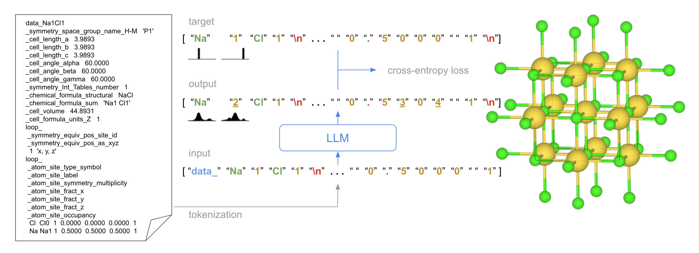

CrystaLLM
==============

CrystaLLM is a Transformer-based Large Language Model of the CIF (Crystallographic Information File) format. The model 
can be used to generate crystal structures, and is based on the [GPT-2 model](https://github.com/openai/gpt-2). This 
repository contains code that can be used to reproduce the experiments in the paper
_[Crystal Structure Generation with Autoregressive Large Language Modeling](https://arxiv.org/abs/2307.04340)_. The 
model definition, training, and inference code in this repository is adapted from the  
[nanoGPT](https://github.com/karpathy/nanoGPT) repository.



## Table of Contents

- [Getting Started](#getting-started)
  - [Prerequisites](#prerequisites)
  - [Creating a Local Environment](#creating-a-local-environment)
  - [Installing Dependencies](#installing-dependencies)
- [Obtaining the Training Data](#obtaining-the-training-data)
  - [Downloading the Original CIF Files](#downloading-the-original-cif-files)
  - [Deduplicating the Original CIF Files](#deduplicating-the-original-cif-files)
  - [Pre-processing the CIF Files](#pre-processing-the-cif-files)
  - [Splitting the Dataset into Train, Validation and Test Sets](#splitting-the-dataset-into-train-validation-and-test-sets)
  - [Tokenizing the Dataset](#tokenizing-the-dataset)
  - [Identifying CIF Start Indices](#identifying-cif-start-indices)
  - [Using Your Own CIF Files](#using-your-own-cif-files)
- [Training the Model](#training-the-model)
- [Generating Crystal Structures](#generating-crystal-structures)
  - [Random Sampling](#random-sampling)
  - [Post-processing](#post-processing)
  - [Monte Carlo Tree Search Decoding](#monte-carlo-tree-search-decoding)
  - [Using a Pre-trained Model](#using-a-pre-trained-model)
- [Evaluating Generated CIF Files](#evaluating-generated-cif-files)
- [Extracting the Learned Embeddings](#extracting-the-learned-embeddings)
- [The Challenge Set](#the-challenge-set)
- [Benchmarking](#benchmarking)
- [Data Availability](#data-availability)
- [Tests](#tests)
- [Need Help?](#need-help)
- [Citing CrystaLLM](#citing-crystallm)

## Getting Started

### Prerequisites

- This project requires Python 3.9 or greater. 

- This project uses Poetry for dependency management. Install Poetry if it's 
not installed on your system, by following the instructions [here](https://python-poetry.org/docs/#installation).

### Creating a Local Environment

Perform the following steps to create and activate a local environment:

1. Create a Python virtual environment:

```shell
python -m venv crystallm_venv
```

2. Activate the virtual environment:

```shell
source crystallm_venv/bin/activate
```

### Installing Dependencies

Clone this repository to your local machine. Then, from the root of the cloned project, install the required packages 
by running:

```shell
poetry install
```

This command reads the `pyproject.toml` file, and installs all the dependencies in the virtual environment.

_NOTE: You may need to perform extra, or alternate steps to install PyTorch on your particular system. See the 
[PyTorch documentation](https://pytorch.org/get-started/locally/) for more information._

## Obtaining the Training Data

### Downloading the Original CIF Files

The pre-assembled collection of CIF files which have been downloaded from the 
[Materials Project (MP)](materialsproject.org), the [OQMD](https://oqmd.org/), and 
[NOMAD](https://nomad-lab.eu/nomad-lab/) are contained in the `cifs_v1_orig.tar.gz` file. To download this file, 
execute the following command from the root of the cloned project:

```shell
python bin/download.py cifs_v1_orig.tar.gz
```

This archive contains 3,551,492 CIF files, each containing a unique filename assigned by us which indicates the 
origin of the file, which we refer to as its ID. For subsequent steps, we require that inputs be provided as a 
serialized Python list, in pickle format, because it is the most efficient format we found for working with over 
3 million CIF files in this context. Therefore, we provide a utility for converting the .tar.gz file to a .pkl.gz file:

```shell
python bin/tar_to_pickle.py cifs_v1_orig.tar.gz cifs_v1_orig.pkl.gz
```

The resulting .pkl.gz file contains a serialized Python list of 3,551,492 `(ID, CIF string)` 2-tuples. 
Alternatively, the `cifs_v1_orig.pkl.gz` can be downloaded directly:

```shell
python bin/download.py cifs_v1_orig.pkl.gz
```

However, please be aware that this .pkl.gz file is reliant on Python's serialization mechanism, and may not be 
compatible with future versions of Python.

_NOTE: These files are close to 700 MB in size._

_This dataset includes data from the [Materials Project](https://materialsproject.org/)._ 
> A. Jain*, S.P. Ong*, G. Hautier, W. Chen, W.D. Richards, S. Dacek, S. Cholia, D. Gunter, D. Skinner, G. Ceder, K.A. 
Persson (*=equal contributions). The Materials Project: A materials genome approach to accelerating materials 
innovation. APL Materials, 2013, 1(1), 011002.

_This dataset includes data from the [OQMD database](http://oqmd.org/)._
>  J. E. Saal, S. Kirklin, M. Aykol, B. Meredig, and C. Wolverton. Materials Design and Discovery with 
High-Throughput Density Functional Theory: The Open Quantum Materials Database (OQMD). JOM 65, 1501-1509 (2013).

_This dataset includes data from [NOMAD](https://nomad-lab.eu/nomad-lab/)._
> M. Scheidgen, L. Himanen, A. Ladines, D. Sikter, M. Nakhaee, Á. Fekete, T. Chang, A. Golparvar, J. Márquez, 
S. Brockhauser, S. Brückner, L. Ghiringhelli, F. Dietrich, D. Lehmberg, T. Denell, A. Albino 1, H. Näsström, S. Shabih, 
F. Dobener, M. Kühbach, R. Mozumder, J. Rudzinski, N. Daelman, J. Pizarro, M. Kuban, C. Salazar, P. Ondračka, 
H.-J. Bungartz, C. Draxl. NOMAD: A distributed web-based platform for managing materials science research data. Journal 
of Open Source Software, 8(90), 5388.

_This dataset is licensed under [CC-BY 4.0](https://creativecommons.org/licenses/by/4.0/)._

### Deduplicating the Original CIF Files

The original CIF dataset contains duplicates when combinations of cell composition and space group are considered. To 
disambiguate CIF files that have the same combination of cell composition and space group, we choose the CIF file with
the lowest volume per formula unit. To deduplicate the original CIF file dataset, execute the following command from 
the root of the cloned project:

```shell
python bin/deduplicate.py cifs_v1_orig.pkl.gz --out cifs_v1_dedup.pkl.gz
```

This will produce the `cifs_v1_dedup.pkl.gz` file, which contains a serialized Python list of 2,285,914 CIF strings, 
each as a 2-tuple, `(ID, CIF string)`, where every ID is unique.

Alternatively, the `cifs_v1_dedup.pkl.gz` file can be downloaded directly:

```shell
python bin/download.py cifs_v1_dedup.pkl.gz
```

The `cifs_v1_dedup.tar.gz` file can also be downloaded and converted locally to the `cifs_v1_dedup.pkl.gz` file using 
the `tar_to_pickle.py` script.

### Pre-processing the CIF Files

Before the CIF dataset can be used, it must be standardized and augmented. We refer to this step as _pre-processing_.
To pre-process the CIF dataset, execute the following command from the root of the cloned project:

```shell
python bin/preprocess.py cifs_v1_dedup.pkl.gz --out cifs_v1_prep.pkl.gz --workers 4
```

This will produce the `cifs_v1_prep.pkl.gz` file, which contains a serialized Python list of 2,285,719 augmented 
CIF strings, each as a 2-tuple, `(ID, CIF string)`, where every ID is unique. The number of processes can be specified 
with the `workers` argument, to speed up processing.

Alternatively, the `cifs_v1_prep.pkl.gz` file can be downloaded directly:

```shell
python bin/download.py cifs_v1_prep.pkl.gz
```

The `cifs_v1_prep.tar.gz` file can also be downloaded and converted locally to the `cifs_v1_prep.pkl.gz` file using 
the `tar_to_pickle.py` script.

### Splitting the Dataset into Train, Validation and Test Sets

To split the CIF dataset into train, validation and test sets, execute the following command from the root of the 
cloned project:

```shell
python bin/split.py cifs_v1_prep.pkl.gz \
--train_out cifs_v1_train.pkl.gz \
--val_out cifs_v1_val.pkl.gz \
--test_out cifs_v1_test.pkl.gz
```

This will produce the `cifs_v1_train.pkl.gz`, `cifs_v1_val.pkl.gz`, and `cifs_v1_test.pkl.gz` files. The 
`random_state`, `validation_size`, and `test_size` arguments can also be specified, but have default values of 
`20230610`, `0.10`, and `0.0045`, respectively.

The `cifs_v1_train.pkl.gz` file contains a serialized Python list with 2,047,889 entries. The `cifs_v1_val.pkl.gz`
file contains a serialized Python list with 227,544 CIF entries. The `cifs_v1_test.pkl.gz` file contains a serialized 
Python list with 10,286 entries. Each entry is a 2-tuple, `(ID, CIF string)`, where every ID is unique.

Alternatively, the `cifs_v1_train.pkl.gz`, `cifs_v1_val.pkl.gz`, and `cifs_v1_test.pkl.gz` files can be downloaded 
directly, using, for example:

```shell
python bin/download.py cifs_v1_train.pkl.gz
```

The `cifs_v1_train.tar.gz`, `cifs_v1_val.tar.gz`, and `cifs_v1_test.tar.gz` files can also be downloaded and converted 
locally to the corresponding .pkl.gz files using  the `tar_to_pickle.py` script.

### Tokenizing the Dataset

Before the model can process the CIF files, they must be tokenized; that is, they must be converted into a sequence of 
integers representing the distinct sequence of symbols that comprise the CIF files. Only the training set (and 
optionally the validation set) need to be tokenized. To tokenize the CIF files:

```shell
python bin/tokenize_cifs.py \
--train_fname cifs_v1_train.pkl.gz \
--val_fname cifs_v1_val.pkl.gz \
--out_dir tokens_v1_train_val/ \
--workers 4
```
The result of this command is that the `tokens_v1_train_val/` directory will be created. In the directory, the following
files will be present: `train.bin`, `val.bin`, `meta.pkl`, and `tokens_v1_train_val.tar.gz`. The files ending in .bin 
contain the token indices. These files are NumPy arrays of type `np.uint16` that have been serialized to a binary 
format. The file `tokens_v1_train_val.tar.gz` is simply a compressed tarball containing the `train.bin`, `val.bin`, and 
`meta.pkl` files, for convenience.

Alternatively, the `tokens_v1_train_val.tar.gz` file can be downloaded directly:

```shell
python bin/download.py tokens_v1_train_val.tar.gz
```

Another option is to tokenize the entire dataset:

```shell
python bin/tokenize_cifs.py \
--train_fname cifs_v1_prep.pkl.gz \
--out_dir tokens_v1_all/ \
--workers 4
```

The resulting `tokens_v1_all.tar.gz` file can alternatively be downloaded directly:

```shell
python bin/download.py tokens_v1_all.tar.gz
```

### Identifying CIF Start Indices

At training time, the token start indices of the training CIFs can optionally be provided. These must be extracted from
the tokenized files. To identify the token start indices:

```shell
python bin/identify_starts.py \
--dataset_fname tokens_v1_train_val.tar.gz \
--out_fname starts_v1_train.pkl
```

Note that only the training set start indices are extracted, and not the validation set's, despite it being present in 
the provided file.

Alternatively, the `starts_v1_train.pkl` file can be downloaded directly:

```shell
python bin/download.py starts_v1_train.pkl
```

### Using Your Own CIF Files

To use your own CIF files, prepare a directory containing the CIF files. Ensure that each CIF file has a unique name
and ends with the `.cif` extension. Then, perform the following steps:

1. Prepare the custom CIF files:
```shell
python bin/prepare_custom.py custom_cifs/ custom_cifs.tar.gz
```
where `custom_cifs/` is the name of the directory containing the CIF files to be prepared, and `custom_cifs.tar.gz` is
the name of the .tar.gz file to be created, which will contain the prepared CIF files.

2. To use the downstream scripts (e.g. to pre-process the files so that they can be split and tokenized), convert the 
.tar.gz file to a .pkl.gz file:
```shell
python bin/tar_to_pickle.py custom_cifs.tar.gz custom_cifs.pkl.gz
```

## Training the Model

To train the model, use the `bin/train.py` script. The training script expects the path to a directory containing the 
tokenized and encoded dataset. The directory is expected to have the following files:

- `train.bin`: binary file containing the encoded training tokens produced during the tokenization step 
(required)
- `val.bin`: binary file containing the encoded validation tokens produced during the tokenization step 
(required if `validate` is `True`, else optional)
- `starts.pkl`: sorted Python list of CIF start indices for the training set (optional)
- `starts_val.pkl`: sorted Python list of CIF start indices for the validation set (optional)

The training script uses a set of configuration options that define how training should behave. These configuration 
options all have default values, except for the `dataset` option, which specifies the path to the training dataset. It 
is the only option that is required to be specified by the user.

<details>
  <summary>Expand for supported configuration options and their default values</summary>

  ```python
  out_dir: str = "out"  # the path to the folder where the model checkpoints will be stored
  eval_interval: int = 250  # how often to evaluate against the validation set
  log_interval: int = 1  # how often to print to
  eval_iters_train: int = 200
  eval_iters_val: int = 200
  eval_only: bool = False  # if True, script exits right after the first eval
  always_save_checkpoint: bool = False  # if True, always save a checkpoint after each eval
  init_from: str = "scratch"  # 'scratch' or 'resume'
  
  # data
  dataset: str = ""  # the path to the folder containing the .bin files with encoded tokens
  gradient_accumulation_steps: int = 40  # used to simulate larger batch sizes
  batch_size: int = 64  # if gradient_accumulation_steps > 1, this is the micro-batch size
  block_size: int = 2048  # context of up to `block_size` previous characters
  
  # model
  n_layer: int = 12
  n_head: int = 12
  n_embd: int = 768
  dropout: float = 0.0  # for pretraining 0 is good, for finetuning try 0.1+
  bias: bool = False  # do we use bias inside LayerNorm and Linear layers?
  
  # AdamW optimizer
  learning_rate: float = 6e-4  # max learning rate
  max_iters: int = 600000  # total number of training iterations
  weight_decay: float = 1e-1
  beta1: float = 0.9
  beta2: float = 0.95  # make a bit bigger because number of tokens per iter is small
  grad_clip: float = 1.0  # clip gradients at this value, or disable if == 0.0
  
  # learning rate decay settings
  decay_lr: bool = True  # whether to decay the learning rate
  warmup_iters: int = 2000  # how many steps to warm up for; not super necessary potentially
  lr_decay_iters: int = 600000  # should be ~= max_iters per Chinchilla
  min_lr: float = 6e-5  # minimum learning rate, should be ~= learning_rate/10 per Chinchilla
  
  # system
  device: str = "cuda"  # examples: 'cpu', 'cuda', 'cuda:0', 'cuda:1' etc., or try 'mps' on macbooks
  dtype: str = "bfloat16"  # 'float32', 'bfloat16', or 'float16', the latter will auto implement a GradScaler
  compile: bool = True  # use PyTorch 2.0 to compile the model to be faster
  underrep_p: float = 0.0
  validate: bool = False  # whether to evaluate the model using the validation set
  ```
</details>

All the other options can be changed by specifying their values in a .yaml file, or as command line arguments when 
invoking the `bin/train.py` script. _NOTE: When an option occurs both in the .yaml file and as a command line argument, 
the command line argument will have precedence._

In the following minimal example, we have a directory named `tokens_v1_all`, which contains a file named `train.bin`, 
which contains all the dataset's encoded tokens, and we start training using the data in that folder:
```shell
python bin/train.py dataset=tokens_v1_all
```
In the example above, the configuration options (e.g. learning rate, number of training iterations, etc.) will be 
assigned their default values. If we want to override these options with our own values, we can use a .yaml file: 

```shell
python bin/train.py --config=my_train.yaml
```
where `my_train.yaml` contains all the options to be overriden (including the `dataset` option). 

We can also supply command line arguments, in addition to a .yaml file:
```shell
python bin/train.py --config=my_train.yaml dropout=0.3
```
In this case, the `dropout` option will have a value of 0.3, regardless of what's in the .yaml file.

See the `config/train_example.yaml` file for a more detailed example. We've also included the configurations used for 
the large and small models in the `config` directory.

It's also good practice to specify a value for the `out_dir` option, which is the path to the directory where the model
will be saved. During training, a checkpoint containing the current model is saved to this directory periodically 
(depending on how training is configured). The checkpoint is a file named `ckpt.pt`, and any existing 
`ckpt.pt` file in the `out_dir` will be overwritten every time the model is saved during training.

## Generating Crystal Structures

### Random Sampling

To randomly sample from a trained model, and generate CIF files, use the `bin/sample.py` script. The sampling script 
expects the path to the folder containing the trained model checkpoint, as well as the prompt, and other configuration 
options.

<details>
  <summary>Expand for supported configuration options and their default values</summary>

  ```python
  out_dir: str = "out"  # the path to the directory containing the trained model
  start: str = "\n"  # the prompt; can also specify a file, use as: "FILE:prompt.txt"
  num_samples: int = 2  # number of samples to draw
  max_new_tokens: int = 3000  # number of tokens generated in each sample
  temperature: float = 0.8  # 1.0 = no change, < 1.0 = less random, > 1.0 = more random, in predictions
  top_k: int = 10  # retain only the top_k most likely tokens, clamp others to have 0 probability
  seed: int = 1337
  device: str = "cuda"  # examples: 'cpu', 'cuda', 'cuda:0', 'cuda:1', etc.
  dtype: str = "bfloat16"  # 'float32' or 'bfloat16' or 'float16'
  compile: bool = False  # use PyTorch 2.0 to compile the model to be faster
  ```

</details>

For example:
```shell
python bin/sample.py \
out_dir=out/my_model \
start=FILE:out/prompt.txt \
num_samples=2 \
top_k=10 \
max_new_tokens=3000 \
device=cuda
```
In the above example, the trained model checkpoint file exists in the `out/my_model` directory. The prompt is actually
in a file located at `out/prompt.txt`. Alternatively, we could also have placed the configuration options in a .yaml 
file, as we did for training, and specified its path using the `--config` command line option.

The generated CIF files are sent to the console. Note that the CIF files generated using the `bin/sample.py` script will
need to be post-processed.

### Post-processing

The content generated directly by the model needs to be post-processed into a usable CIF file. To post-process the 
output of the model, use the `bin/postprocess.py` script:

```shell
python bin/postprocess.py my_raw_cifs my_processed_cifs
```

In the above example, the first argument is the path to the folder containing "raw" CIF files (i.e. directly generated 
by the model). The folder must contain one or more files ending with the .cif extension. The second argument contains 
the path to the folder where the processed CIF files should be written. This folder will be created if it doesn't exist.

### Monte Carlo Tree Search Decoding

To perform Monte Carlo Tree Search (MCTS) decoding, use the `bin/mcts.py` script. The path to the folder containing a 
trained model will need to be provided. Other configuration options are available to tune the behaviour of the 
algorithm.

<details>
  <summary>Expand for supported configuration options and their default values</summary>

  ```python
  out_dir: str = "out"  # path to the folder containing the model checkpoint file
  temperature: float = 1.0  # 1.0 = no change, < 1.0 = less random, > 1.0 = more random, in predictions
  start: str = "\n"  # the prompt; can also specify a file, use as: "FILE:prompt.txt"
  seed: int = 1337
  device: str = "cuda"  # examples: 'cpu', 'cuda', 'cuda:0', 'cuda:1', etc.
  dtype: str = "bfloat16"  # 'float32' or 'bfloat16' or 'float16'
  compile: bool = False  # use PyTorch 2.0 to compile the model to be faster
  tree_width: int = 10  # the tree width
  max_depth: int = 1000  # the maximum depth of the tree
  c: float = 5.  # the selector constant: c_puct for PUCT, c for UCT, epsilon for greedy
  num_simulations: int = 200  # the number of simulations to perform during search
  bond_length_acceptability_cutoff: float = 1.0
  reward_k: float = 2.0  # the reward constant
  mcts_out_dir: str = "mcts"  # path to the directory where generated CIF files will be stored
  scorer: str = "zmq"  # supported values: 'zmq', 'random'
  scorer_host: str = "localhost"  # required if `scorer` is 'zmq'
  scorer_port: int = 5555  # required if `scorer` is 'zmq'
  use_context_sensitive_tree_builder: bool = True
  top_child_weight_cutoff: float = 0.99
  selector: str = "puct"  # valid values: 'puct', 'uct', 'greedy'
  n_space_groups: int = 0
  bypass_only_child: bool = False
  n_rollouts: int = 1  # the number of rollouts to perform per simulation
  ```

</details>

For example:
```shell
python bin/mcts.py \
out_dir=out/my_model \
device=cuda \
dtype=float16 \
start=FILE:out/prompt.txt \
tree_width=5 \
max_depth=2000 \
selector=puct \
c=1.0 \
num_simulations=1000 \
reward_k=2.0 \
scorer=random \
top_child_weight_cutoff=0.9999 \
bypass_only_child=True \
mcts_out_dir=out/my_mcts_cifs
```
In the above example, the trained model checkpoint file exists in the `out/my_model` directory. The prompt is actually
in a file located at `out/prompt.txt`. The generated (post-processed) CIF files will be placed in the `mcts_out_dir` 
directory. We could also have placed the configuration options in a .yaml file, as we did for training, and specified 
its path using the `--config` command line option.

Note that in the example above, the `scorer` configuration option was assigned a value of `random`. This instructs the 
algorithm to make use of a random scorer, which will assign a random score to each CIF file. The random scorer is 
intended to be used only for demonstration or debugging purposes, when a true scorer is not available. In practice, a 
true scorer, which assigns a score based on the quality of the generated CIF, should be used. Support is provided for 
obtaining the score from another process, via the ZMQ library, and in such a case, the `scorer` would be assigned a 
value of `zmq`. See [this script](resources/alignn_zmq_example.py) for an example of setting up 
[ALIGNN](https://github.com/usnistgov/alignn) to listen for and respond to prediction requests using ZMQ.

### Using a Pre-trained Model

To use a pre-trained model, first download it:
```shell
python bin/download.py crystallm_v1_small.tar.gz
```
Then, decompress and extract the file:
```shell
tar xvf crystallm_v1_small.tar.gz
```
This will result in a folder named `crystallm_v1_small` containing a `ckpt.pt` file. Indicate the `crystallm_v1_small` 
directory when using the `bin/sample.py` script, for example.

The [config](config/) folder in this project contains a number of model configuration .yaml files. A corresponding 
.tar.gz model file exists for each .yaml file in that directory that begins with _crystallm__, which can be downloaded.

## Evaluating Generated CIF Files

The `bin/evaluate_cifs.py` script can be used to evaluate CIF files generated by the model. As an example, take the 
CIF files of the main dataset's test set and create prompts from them:
```shell
python bin/make_prompts.py cifs_v1_test.pkl.gz -o prompts_v1_test.tar.gz
```

Then, use the `bin/generate_cifs.py` script to generate CIF files using the small model:
```shell
python bin/generate_cifs.py \
--model crystallm_v1_small \
--prompts prompts_v1_test.tar.gz \
--out gen_v1_small_raw.tar.gz \
--device cuda \
--num-gens 1
```

Finally, perform the evaluation:
```shell
python bin/evaluate_cifs.py gen_v1_small_raw.tar.gz -o gen_v1_small_eval.csv
```

The results of the evaluation will be printed to the console and stored in the generated `gen_v1_small_eval.csv` file.
The results will include:
- the fraction of generated CIF files where the printed space group is consistent with the generated structure
- the fraction of generated CIF files that are consistent in terms of atom site multiplicity
- the average bond length reasonableness score, and the fraction of generated CIF files that have reasonable 
  bond lengths
- the fraction of generated CIF files that are valid
- the longest valid generated tokenized length
- the average valid generated tokenized length

The .csv file will contain more information for each of the (processable) generated CIF files, including the generated 
and implied cell volumes, and whether the generation was valid.

## Extracting the Learned Embeddings

To extract the learned atom, digit, and space group embeddings from a trained model, use the 
`bin/extract_embeddings.py` script:

```shell
python bin/extract_embeddings.py out/my_model \
--dataset tokens_v1_all.tar.gz \
--out my_model.atom_vectors.csv \
--type atom
```

In the example above, the `out/my_model` folder contains the model checkpoint file. The dataset .tar.gz file that was 
used to train the model is also required, as we need the `meta.pkl` file containing the token-to-index mappings. The 
`my_model.atom_vectors.csv` indicates the name of the .csv file that will contain the embeddings. Finally, the `type` 
option indicates what type of embedding to extract. Supported values are: `atom`, `digit`, and `spacegroup`.

The extracted embeddings for the small model are made available in this project, in the `resources` folder:
- `crystallm_v1_small.atom_vectors.csv`
- `crystallm_v1_small.number_vectors.csv`
- `crystallm_v1_small.spacegroup_vectors.csv`

To read the embeddings from the .csv file:

```python
from crystallm import embeddings_from_csv

embeddings = embeddings_from_csv("./my_model.atom_vectors.csv")
```
The `embeddings` is a Python dictionary where a key is a token, and the value is a NumPy array.

## The Challenge Set

The challenge set can be downloaded:
```shell
python bin/download.py challenge_set_v1.zip
```
The .zip file contains a separate folder for each of the compounds in the challenge set. Each folder contains 3 files:
the compound's original CIF file, a .txt file containing the prompt for the compound without the space group, and a 
.txt file containing the prompt for the compound with the space group. A `properties.csv` file is also present which
lists various physical properties for the compounds in the set.

## Benchmarking

CrystaLLM has been evaluated on the Perov-5, Carbon-24, MP-20 and MPTS-52 benchmarks. To reproduce the benchmark 
evaluation experiments, see [this document](BENCHMARKING.md).

## Data Availability

All trained models, training sets, and artifacts generated by the models have been uploaded to Zenodo. The files are 
publicly accessible at: [https://zenodo.org/records/10642388](https://zenodo.org/records/10642388). All files are 
released under the [CC-BY 4.0](https://creativecommons.org/licenses/by/4.0/) license.

A catalog of all the available files is located in [this document](ARTIFACTS.md). 

## Tests

To run the unit tests:

```shell
python -m unittest discover tests
```

## Need Help?

If you encounter any issues, or have any questions, please feel free to open an issue in this repository.

## Citing CrystaLLM

Please use the following bibtex entry:
```
@article{antunes2023crystal,
  title={Crystal Structure Generation with Autoregressive Large Language Modeling},
  author={Antunes, Luis M and Butler, Keith T and Grau-Crespo, Ricardo},
  journal={arXiv preprint arXiv:2307.04340},
  year={2023}
}
```
